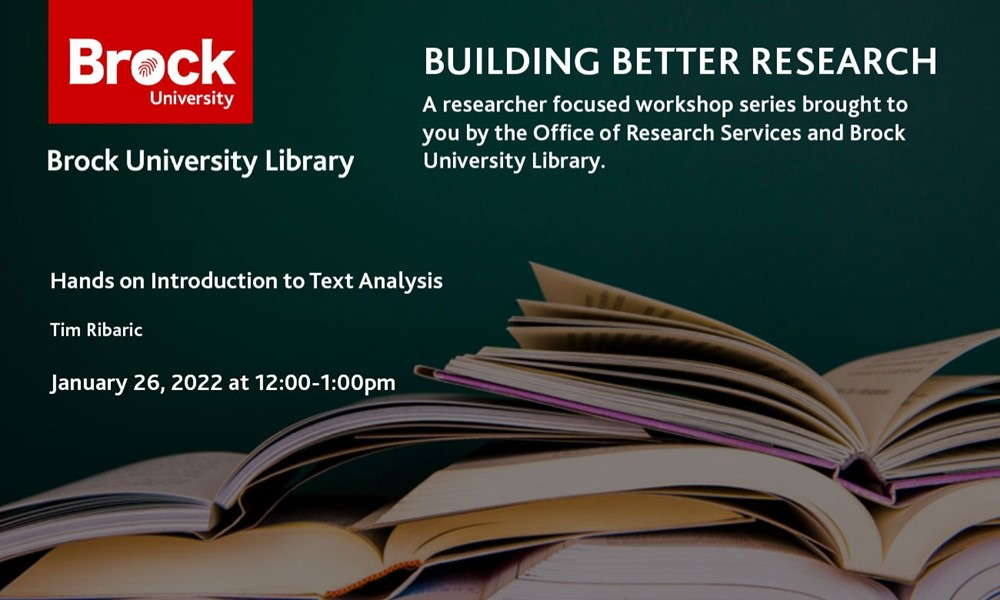

# Introduction to Text Analysis
## Building Better Research Series

January 26, 2022.

Brock Community [Register](https://experiencebu.brocku.ca/event/190605) 

This session will provide you with the basics of text analysis no matter what discipline your research is in.

- [Presentation](https://brockdsl.github.io/BRB_Intro_To_Text_Analysis/presentation/index.html)
- [Google Colab Notebook](https://colab.research.google.com/github/BrockDSL/BRB_Intro_To_Text_Analysis/blob/main/BRB_Introduction_to_Text_Analysis.ipynb) - imports directly into Google Colab!